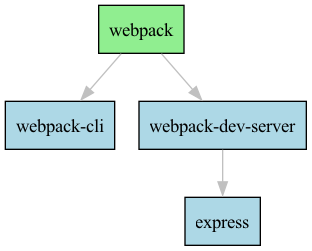

# Инструмент визуализации графа зависимостей Python-пакетов

## Общее описание

Инструмент представляет собой CLI-приложение на Node.js, предназначенное для анализа и визуализации графа зависимостей Python-пакетов (формат `pip`, `requirements.txt`).

Приложение поддерживает два режима работы:

- **обычный режим** — загрузка зависимостей по URL;
- **тестовый режим** — использование локального файла с описанием графа.

Функциональные возможности:

- получение зависимостей без использования `pip`;
- построение графа зависимостей и обратных зависимостей;
- обход графа DFS (без рекурсии);
- ASCII-визуализация зависимостей;
- экспорт графа в формате Graphviz (DOT);
- генерация PNG-изображений через Graphviz.

Проект состоит из модульной архитектуры: загрузчики, парсеры, обработчики графа, визуализаторы и главный управляющий модуль.

---

## Описание всех функций и настроек

### Параметры командной строки

| Опция                 | Описание                            |
| --------------------- | ----------------------------------- |
| `--package <name>`    | Имя анализируемого пакета           |
| `--url <url>`         | URL файла `requirements.txt`        |
| `--file <path>`       | Путь к тестовому файлу (test-mode)  |
| `--test-mode`         | Включает режим тестирования         |
| `--pkg-version <ver>` | Версия пакета                       |
| `--ascii`             | Вывести дерево зависимостей в ASCII |
| `--reverse`           | Показать обратные зависимости       |

---

## Запуск и использование

### Установка

```bash
npm install
```

### Базовый запуск

```bash
node cli/cli.js --package flask --url <url>
```

### Использование в тестовом режиме

Пример файла test-graph.txt
A B C
B D
C
D

Команда:

```bash
node cli/cli.js --test-mode --file test-graph.txt --package A
```

Вывод:

Граф тестового репозитория:
{ A: [ 'B', 'C' ], B: [ 'D' ], C: [], D: [] }

Порядок обхода DFS:
[ 'A', 'B', 'D', 'C' ]

### Использование с реальным requirements.txt по URL

```bash
node cli/cli.js --package flask \
 --url https://raw.githubusercontent.com/pallets/flask/main/requirements.txt
```

Вывод (пример):
Содержимое requirements-файла получено.

Прямые зависимости:
[ 'click', 'itsdangerous', 'jinja2', 'werkzeug' ]

Граф зависимостей:
{
flask: [ 'click', 'itsdangerous', 'jinja2', 'werkzeug' ]
}

Результат DFS:
[ 'flask', 'click', 'itsdangerous', 'jinja2', 'werkzeug' ]

### ASCII-дерево зависимостей

```bash
node cli/cli.js --test-mode --file test-graph3.txt --package webpack --ascii
```

Вывод:

webpack
├── webpack-cli
└── webpack-dev-server
└── express

### Обратные зависимости

```bash
node cli/cli.js --test-mode --file test-graph3.txt --package express --reverse
```

Вывод:

Обратный граф зависимостей:
{
webpack: [],
webpack-cli: [ 'webpack' ],
webpack-dev-server: [ 'webpack' ],
express: [ 'webpack-dev-server' ]
}

Пакеты, которые зависят от 'express':
[ 'webpack-dev-server' ]

### Генерация PNG-графа через Graphviz

```bash
node cli/cli.js --test-mode --file test-graph3.txt --package webpack
```

Пример DOT-кода:

digraph dependencies {
rankdir=TB;
node [shape=box, style=filled, fillcolor=lightblue];
edge [color=gray];

    "webpack" [fillcolor=lightgreen];

    "webpack" -> "webpack-cli";
    "webpack" -> "webpack-dev-server";
    "webpack-dev-server" -> "express";

}

PNG-файл сохраняется как:


